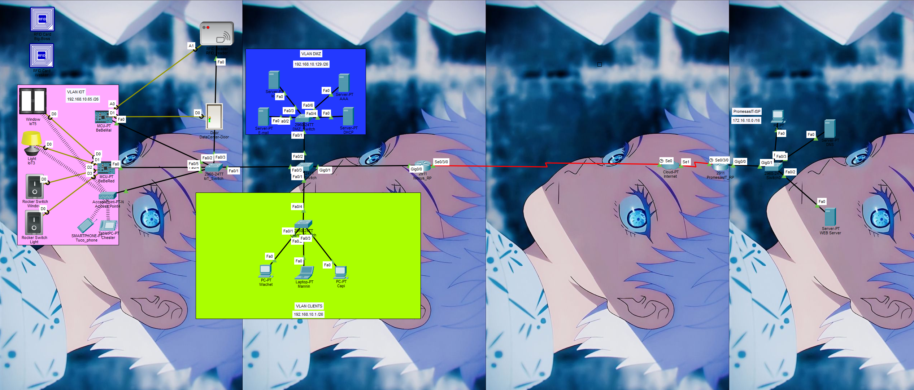

    
    

# Nexus - Network Infrastructure

## Overview

This project is a simulated network infrastructure developed mainly in packet tracer.
Is the Final Project of the technical specialty of Networking and Operative Systems.
I used CCNA skills, scripting in JavaScript and Python and IoT knowledge gotten in
the technical specialty.
This project had become a personal project since I added many things that weren't asked
in order to practice many concepts of networking and programming.

## Network Topology

There's two zones, the ISP side called "PromesasIT_ISP" which host a DNS server and a WEB server.
The second side is called "Nexus". This network simulates a corporate network and is composed
for 3 VLANS, one for the DMZ zone, another one for the Clients which simulates the network used
for employees and a VLAN specifically for IoT devices.

## IP addressing
See the full [IP Addressing Table](docs/addressing.md).

## WAN & Routing

- Frame Relay over PT-Cloud (DLCIs).
- OSPF between Nexus_RP and PromesasIT_RP.

## Network Services

- The ISP took the role of hosting DNS+Web making the http GET method be possible thanks to the configuration.

- In the internal DMZ zone of the company, many services such as AAA, SMTP, POP3, IoT monitoring and DCHP
were available to be used across the internal network.

## IoT Ecosystem

For this part two MCU were used to realize different tasks.
The first MCU called "BebeMal" is configured and programmed to work as a signal transmiter for the door
which will will receive an incoming signal from the MCU that comes from the RFID Reader after performing
the check of the Card ID. All this using two JavaScript Scripts.

The second MCU called "BebeRed" performs two different tasks. It works with a light who can be turned on
and off with a switch. It also works with a window which can be opened and closed with a switch button.
All this was programmed using Python.

